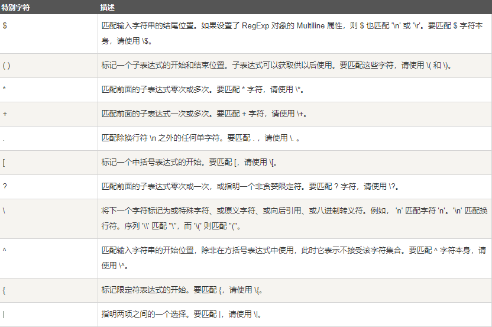
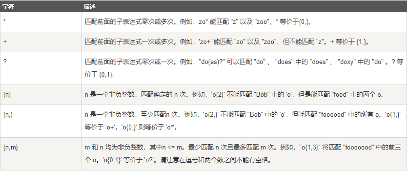
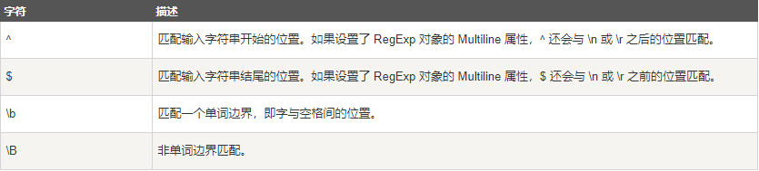
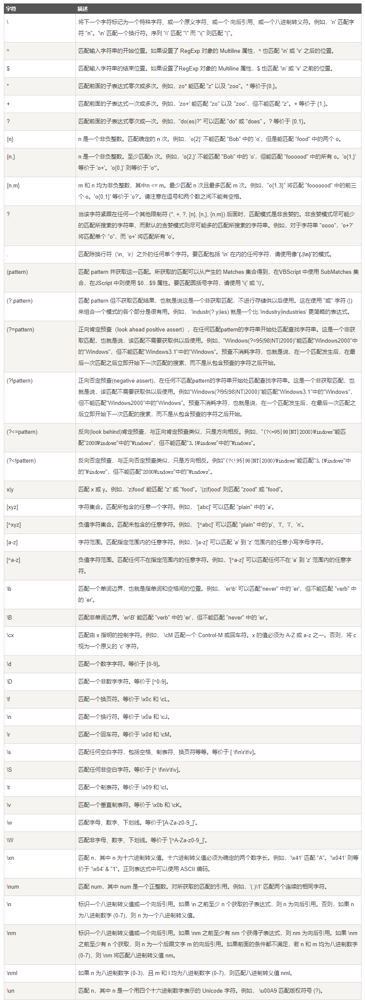
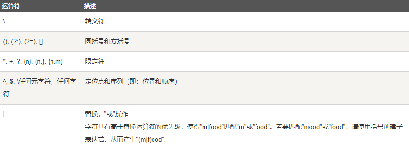

## 简介 ##
&emsp;&emsp;正则表达式其实是一种对字符串的描述，可以用来检查一个字符串中是否包含符合描述的字符串（子串），或者提取、替换子串。  
&emsp;&emsp;比如`^[0-9]+abc$`，`^`是说匹配输入字符串开始的位置，`[0-9]`是说匹配单个数字，`+`是说一个或者多个，`abc`是说字母abc，`$`是说匹配输入字符串结束的位置。所以整个表达式`^[0-9]+abc$`是描述了一种字符串，这种字符串的特征是**数字开头，字母abc结尾，由数字和字母abc组成的字符串**，就像`123asdaabc`这个字符串就不符合这个描述，因为字符串`123asdaabc`，是数字开头，字母abc结尾，但不是数字和字母abc组成的字符串，还包含了`asda`字母，另一个字符串`123456abc`符合这个描述，数字开头，字母abc结尾，由数字和字母abc组成的字符串。  
&emsp;&emsp;再比如`^[a-z0-9_-]{3,15}$`，`^`是说匹配输入字符串开始的位置，`a-z0-9_-`是说字母a到z数字0到9下划线`_`连字符`-`，`{3,15}`是说3到15个字符的长度，`$`是说匹配输入字符串结束的位置，所以这个正则表达式描述了一种字符串，这种字符串的特征是**包含字母a到z或者数字0到9或者下划线_或者连字符-，长度为3到15个字符**，这个正则表达式，可以匹配`abc，abc1，ab-c，ab_c`，但不会匹配`ab`，因为长度不够，也不会匹配`ab%`，因为包含特殊符号`%`。
## 语法 ##
&emsp;&emsp;比如：`runoo+b`,可以匹配`runoob，runooooob`等，`+`号代表前面的字符必须至少出现一次（1~N次）  
&emsp;&emsp;再比如：`runoo*b`，可以匹配`runob，runooooob`等，`*`号代表前面的字符可以不出现，也可以出现1次或多次（0~N次）  
&emsp;&emsp;再比如：`colou?r`，可以匹配`color，colour` ，`?`号代表前面的字符出现0次或者1次（0~1次）  
&emsp;&emsp;构造正则表达式的方法类似构造数学表达式，用多元字符与运算符可以将小的表达式结合创建更大的表达式。正则表达式的组件可以是单个的字符，字符集合，字符范围，字符间的选择或者所有这些组件的任意组合。  
&emsp;&emsp;正则表达式是由普通字符（比如字母a到z），以及特殊字符（元字符）组成的文字模式。模式描述在搜索文本时要匹配的一个或多个字符串。正则表达式作为一个模板，将某个字符模式与所搜索的字符串进行匹配。  
&emsp;&emsp;**普通字符**  
&emsp;&emsp;普通字符包括没有显示指定为元字符的所有可打印和不可打印字符。这包括所有大写和小写字母，所有数字，所有标点符号和一些其他符号。  
&emsp;&emsp;**非打印字符**  
&emsp;&emsp;是说`\f\n\r`这些回车换行符等等    
&emsp;&emsp;**特殊字符**  
&emsp;&emsp;是说在正则表达式当中具有特殊含义的字符。  
&emsp;&emsp;  

&emsp;&emsp;如果想要匹配特殊字符需要加转义符\。  
&emsp;&emsp;**限定符**  
&emsp;&emsp;是说指定正则表达式的一个给定组件必须要出现多少次才能满足匹配。有`*，+，？，{n}，{n，}，{n，m}`六种  
&emsp;&emsp;  
&emsp;&emsp;    
&emsp;&emsp;比如在匹配章节编号的时候，可以使用`Chapter [1-9][0-9]*`，这个表达式会匹配**编号为任何位数的章节标题**，比如可以匹配`Chapter 1，Chapter 10，Chapter 10111`，不匹配`Chapter aa11，Chapter a1a1`，`Chapter 1aa`只会把`Chapter 1`匹配出来  
&emsp;&emsp;更进一步，想要匹配**编号只到99的章节标题**，正则表达式可以这么写`Chapter [0-9]{1,2}`，这个正则表达式的意思是说匹配**编号是1到2位数字的章节标题**，这个表达式有一个缺点是会匹配`Chapter 0`，而且会把`Chapter 132`这种字符串中的`Chapter 13`匹配出来，就是匹配**开头两位数字** 的意思，更好的写法是`Chapter [1-9][0-9]?`或者`Chapter [1-9][0-9]{0,1}`这两个正则表达式的意思是匹配**编号第一个数字是1到9（非0）第二个数字是0到9的1到2位数字的章节标题**  
&emsp;&emsp;**`*，+`限定符都是贪婪的，因为它们会尽可能多的匹配文字，在它们的后面加上一个`？`号就可以实现非贪婪或最小匹配。**  
&emsp;&emsp;比如，搜索HTML文档查找H1标记内的章节标题  
&emsp;&emsp;文档是这样的：`<H1>Chapter 1 - 介绍正则表达式</H1>`  
&emsp;&emsp;正则表达式这样写`<.*>`意思是匹配**`<`开头`>`结尾的除换行符 `\n` 之外的任何字符**因为是默认**贪婪** 的，所以这个表达式会尽可能的多获得字符，所以表达式中的`>`是指最后一个，而不是`H1`后面的`>`，所以匹配结果是`<H1>Chapter 1 - 介绍正则表达式</H1>`  
&emsp;&emsp;如果只需要匹配开始和结束的`H1`标签  
&emsp;&emsp;正则表达式这样写`<.*?>`意思是匹配**`<`开头`>`结尾的除换行符`\n`以外的任何字符**，但是是**非贪婪**的，所以这个表达式会获取最小匹配，所以匹配结果是这样的`<H1></H1>`  
&emsp;&emsp;**定位符**  
&emsp;&emsp;是说将正则表达式固定到行首或行尾，或者是一个单词内，单词开头，单词结尾。  
&emsp;&emsp;  
&emsp;&emsp;不能限定符与定位符一起用，`^*`是错误的  
## 元字符 ##
&emsp;&emsp;元字符是指在正则表达式中有定义和行为的字符  
&emsp;&emsp;  
## 优先级 ##
&emsp;&emsp;正则表达式相同优先级从左到右计算，不同优先级见下表，从高到低  
&emsp;&emsp;  
## 匹配规则 ##
&emsp;&emsp;**基本模式匹配**  
&emsp;&emsp;模式，是正则表达式最基本的元素，它们是一组描述字符串特征的字符。  
&emsp;&emsp;比如，表达式`^once`意思是匹配**以once开头的字符串** ，这个正则表达式可以匹配`once upon a time`，不匹配`There once was a man from NewYork`  
&emsp;&emsp;同理，`bucket$`匹配**以bucket结尾的字符串** ，所以这个正则表达式可以匹配`Who kept all of this cash in a bucket`，不匹配`buckets`  
&emsp;&emsp;所以，表达式`^bucket$`匹配**以bucket开头并且以bucket结尾的字符串** ，所以就只能匹配`bucket`  
&emsp;&emsp;如果表达式不含有`^和&`，那么他与任何包含这个表达式的字符串匹配，比如`There once was a man from NewYork`，`Who kept all of his cash in a bucket`  
&emsp;&emsp;**字符簇**  
&emsp;&emsp;很多时候，只使用普通的基于字面的字符是不够的，所以需要一种更自由的描述模式，字符簇  
&emsp;&emsp;把所有的元音字符放在一个方括号里面，就是建立一个字符簇  
&emsp;&emsp;比如，`[a-z]`表示匹配**一个小写字母**   
&emsp;&emsp;如果，想要匹配**一个字母和一个数字**的组合，表达式可以这么写`[a-z][0-9]`这个表达式会把，`b12,b1,ab1`中的`b1`匹配出来  
&emsp;&emsp;如果,在表达式前后加上定位符，表达式变成这样`^[a-z][0-9]$`,那么这个表达式就只能匹配**一个字母开头和一个数字结尾** 的字符串，`b12,ab1`这样的字符串就匹配不出来了，只能匹配`b1,c2`这种字符串了  
&emsp;&emsp;`^`不止有定位开头的作用，如果写在方括号`[]`里面的话，`^`还有‘非’的意思，比如，`^[0-9][0-9]$`意思是**首字符不是数字，结尾字符是数字**的字符串，这个表达式匹配`a5,&5`，但是不能匹配`11`  
&emsp;&emsp;特殊字符`.`在正则表达式中用来表示除了“新行”之外的所有字符，比如，`^.5$`匹配**所有两字符的非新行符开头数字5结尾**的字符串  
&emsp;&emsp;**确定重复出现**  
&emsp;&emsp;跟在字符或字符簇后面的`{}`用来确定前面的内容的重复出现的次数  
&emsp;&emsp;花括号`{}`有三种不同的用法，`{x}`代表前面的字符或字符簇出现x次，`{x,}`代表前面的字符或字符簇至少出现x次，`{x,y}`代表前面的字符或字符簇至少出现x次至多出现y次  
&emsp;&emsp;比如，`^a{4}$`匹配`aaaa`，再比如，`^a{4,}$`匹配`aaaa,aaaaa,aaaaa,.....`，再比如`^a{4,6}$`匹配`aaaa,aaaaa,aaaaaa`  